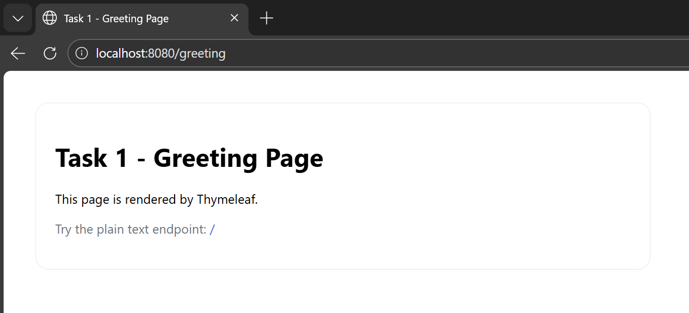
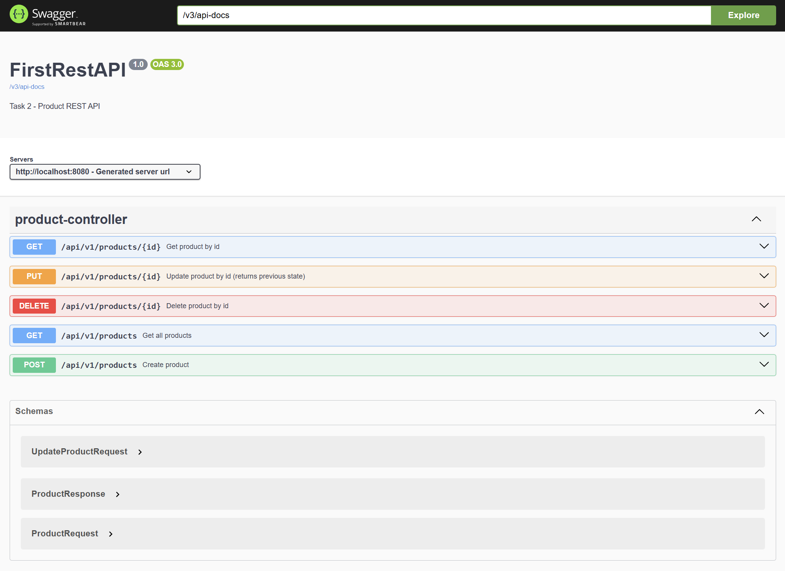

# Java Spring Services

A collection of Spring Boot applications demonstrating modern backend development using Spring MVC, REST APIs, Swagger documentation, and database integration with JPA.

---

## 🚀 Overview

This repository contains two independent Spring Boot applications:

- **Task 1** – A simple Spring MVC application using Thymeleaf for server-side rendering
- **Task 2** – A RESTful Product API with full CRUD operations, Swagger documentation, and H2 in-memory database

The projects are designed to showcase clean structure, REST principles, and real-world backend patterns.

---

## 🧩 Project Structure

java-spring-services/
├── Task1SpringMVC
├── Task2FirstRestAPI
├── screenshots
└── README.md


---

## 🖥️ Task 1 – Spring MVC Application

### Description
A basic Spring MVC application that demonstrates:
- Plain text responses
- Server-side rendered HTML using Thymeleaf
- Static resource handling (images)

### Available Endpoints
- **GET /**  
  Returns a plain text response.

- **GET /greeting**  
  Renders an HTML page using Thymeleaf.

### Screenshot


---

## 🌐 Task 2 – Product REST API

### Description
A RESTful backend service for managing products.  
The application follows layered architecture and exposes CRUD endpoints documented with Swagger.

### Technologies Used
- Java 17
- Spring Boot
- Spring Web
- Spring Data JPA
- H2 In-Memory Database
- Swagger / OpenAPI
- Maven

---

## 📘 Swagger Documentation

Swagger UI is available after running the application:

http://localhost:8080/swagger-ui/index.html




---

## 📦 API Endpoints

### ➕ Create Product
**POST /api/v1/products**

Request body:
```json
{
  "name": "Laptop",
  "price": 1200
}


---

## 📦 API Endpoints

### ➕ Create Product
**POST /api/v1/products**

Request body:
```json
{
  "name": "Laptop",
  "price": 1200
}
